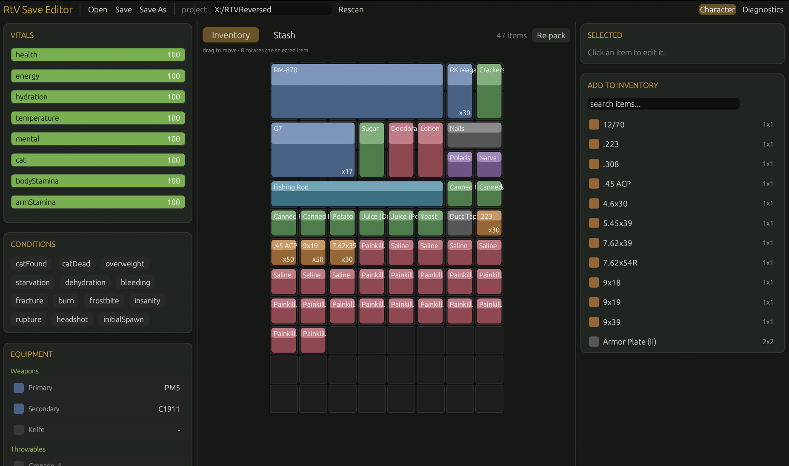
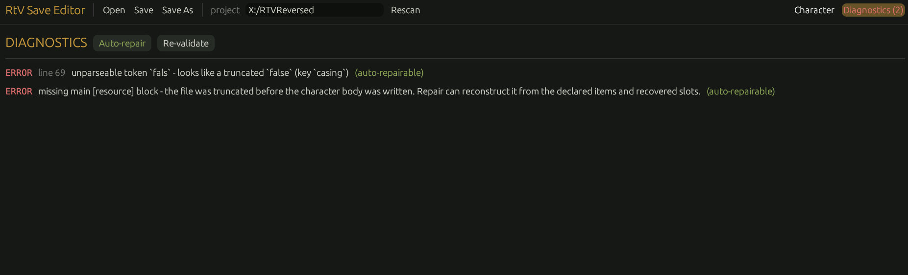

<div align="center">

# RtV Save Editor

**A desktop editor and corruption-repair tool for Road to Vostok `Character.tres` save files.**

[](https://github.com/ovrrde/RtVSaveEditor/actions/workflows/ci.yml)
[](https://github.com/ovrrde/RtVSaveEditor/releases)
[](https://www.rust-lang.org/)



</div>

---

## Features

| | |
|---|---|
| **Visual inventory** | An in-game-style grid - drag to move, rotate, and edit condition / amounts. |
| **Equipment** | Equip, swap, and unequip weapons, armor, and gear by slot. |
| **Vitals & status** | Tweak health, energy, hydration, and condition flags. |
| **Add items** | Browse and drop in any item from the game's catalog. |
| **Auto-repair** | Detects and fixes broken or truncated saves. |
| **Safe by default** | Every save writes a `.tres.bak` backup first. |

---

## Download

Grab the latest **`rtv-save-editor.exe`** from the [**Releases**](https://github.com/ovrrde/RtVSaveEditor/releases) page.
No install needed - just run it.

---

## Usage

1. **Open** your `Character.tres` (usually under `%APPDATA%\Roaming\Road to Vostok\`).
2. Set the **project path** to the game's extracted project files (see note) so the editor knows item names, sizes, and slots.
3. Edit, then **Save** - a backup is written automatically.

> [!IMPORTANT]
> **Getting valid game info.** The editor reads the game's item definitions to show real names,
> grid sizes, and equipment slots. The game ships its assets in a packed `.pck`, so you first need
> to extract the project with [**Godot RE Tools**](https://github.com/bruvzg/gdsdecomp), then point
> the **project path** at the extracted folder. Without it the editor still runs, but falls back to
> raw `res://` paths and default sizes. Planned to remove this later down the line, but for now is somewhat required.

---

## Corruption detection & repair

<div align="center">

</div>

The save lists every item the character owns, so repair **never loses items**. When a save is truncated, it
reconstructs the missing data - completing cut-off entries and rebuilding the character body from what survived.
Anything it can't recover (exact stats, original layout) is reset to sensible defaults, and every change is
logged in the **Diagnostics** tab.

---

## Build from source

Requires [Rust](https://rustup.rs/).

```sh
cargo run --release -p rtv_save_editor   # launch the app
cargo test                               # run the test suite
```

## Roadmap

Support for the game's other saves is planned - **Cabin**, **Tent**, **Traders**, **World**. 

---

<div align="center">
<sub>Back up your saves.</sub>
</div>
